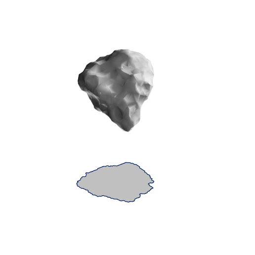
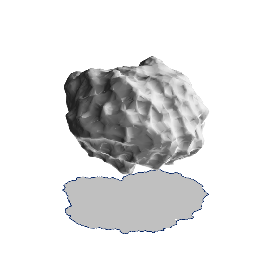

# 3D Object Generation and Visualization

This repository contains MATLAB code for generating and visualizing 3D objects using stochastic modeling techniques. The core of this project is to simulate the growth of complex structures through iterative processes, leveraging convolution operations and random Gaussian fields to influence the object's morphology.

## Features

- **Dynamic 3D Object Generation:** Utilizes a convolution-based approach to progressively build objects within a predefined grid, starting from a central point.
- **Fractal Geometry Application:** Incorporates fractal principles to simulate non-uniform and intricate object structures with varying densities.
- **Visualization Capabilities:** Offers rendering functionalities to visualize the generated objects in 3D space, providing insights into the structure's complexity and detail.
- **Customizable Parameters:** Supports various parameters to control the generation process, including grid size, iteration count, convolution kernel properties, and Gaussian field parameters.

## Usage

To run the simulation, ensure you have MATLAB installed on your system. Open the provided script in MATLAB and execute it. The parameters at the beginning of the script can be adjusted to modify the generation process and visualization aspects.

### Key Parameters:

- `n`: Defines the size of the 3D grid.
- `iterations`: Specifies the number of iterations to perform.
- `cFactor`, `weight_c`, `alpha`, `gLA`, `gEA`, `gLT`, `gET`: Control various aspects of the object's growth and morphology.

## Visualization

The script offers two modes of visualization:

- **3D Rendering:** Displays the evolving structure in 3D space, allowing for rotation and zooming to explore the object's complexity.
- **2D Projection:** Shows a 2D projection of the object, including an outline of its boundary for a clearer understanding of its shape.

## Customization

Users are encouraged to experiment with the parameters to explore different growth patterns and object complexities. The script's modular design facilitates easy modifications to adapt the generation process for specific requirements or to integrate additional features.

## Contributions

Contributions are welcome. If you have ideas for improvements or new features, please feel free to fork the repository and submit a pull request.

